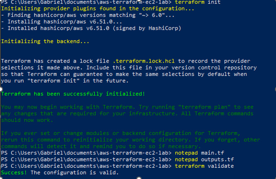
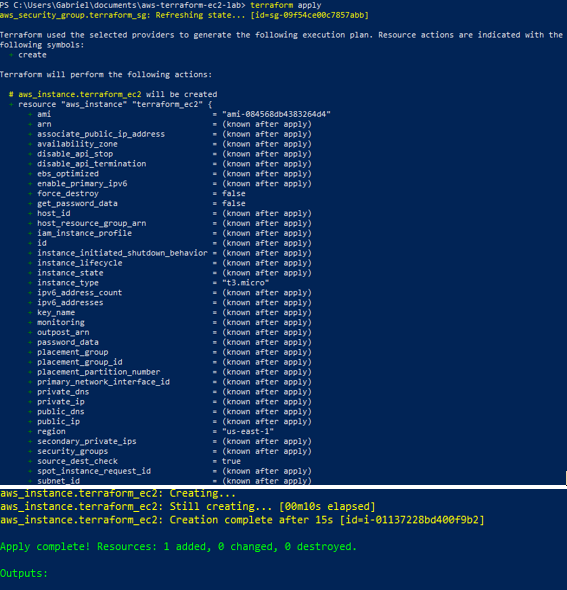
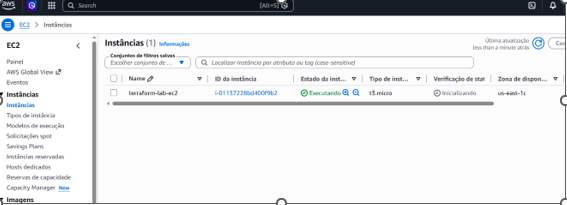
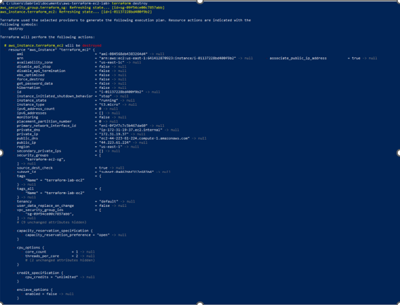
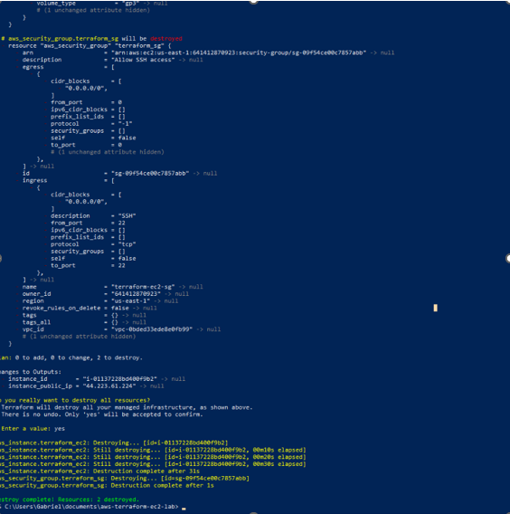

# AWS Terraform EC2 Lab

Infrastructure as Code (IaC) project using Terraform and AWS.

## Objective

Demonstrate how to provision and manage AWS infrastructure using Terraform, including:

* Security Group creation
* EC2 instance provisioning
* Infrastructure validation
* Automated resource destruction

## Technologies Used

* Terraform
* AWS EC2
* AWS IAM
* AWS CLI
* Security Groups
* Infrastructure as Code (IaC)

## Project Architecture

```text
Terraform
    │
    ▼
Security Group
    │
    ▼
EC2 Instance
```

## Files Structure

```text
aws-terraform-ec2-lab/
├── main.tf
├── provider.tf
├── variables.tf
├── outputs.tf
├── .gitignore
├── README.md
└── screenshots/
```

## Terraform Initialization

Terraform provider initialization:



## Infrastructure Provisioning

Terraform creating AWS resources:



## EC2 Instance Created

EC2 instance successfully provisioned through Terraform:



## Infrastructure Destruction

Terraform execution destroying resources:



Resources successfully removed:



## Skills Demonstrated

* Terraform Fundamentals
* Infrastructure as Code (IaC)
* AWS EC2 Provisioning
* Security Group Management
* AWS CLI Configuration
* Cloud Infrastructure Automation
* Resource Lifecycle Management

## Author

Gabriel Paes Cardenette

LinkedIn:
https://linkedin.com/in/gabriel-paes-cardenette-b604b6235

## Certifications

* AWS Certified Cloud Practitioner (CLF-C02)
* Cisco Networking Basics
* Cisco Introduction to Cybersecurity
